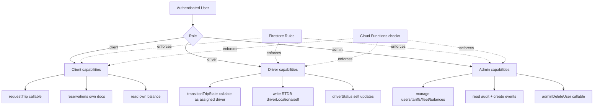
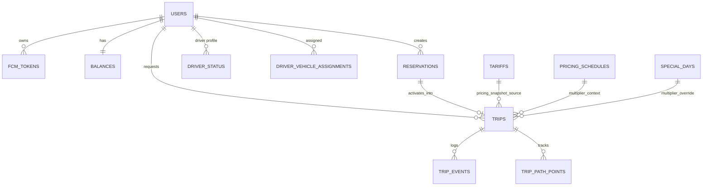
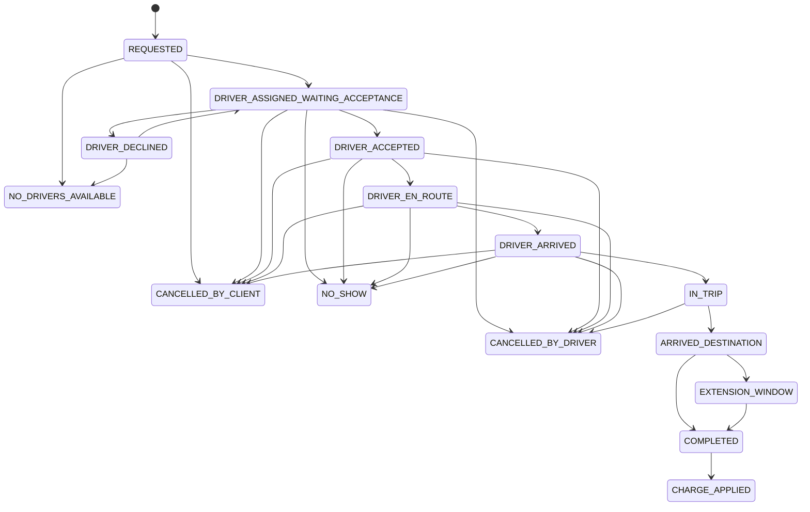
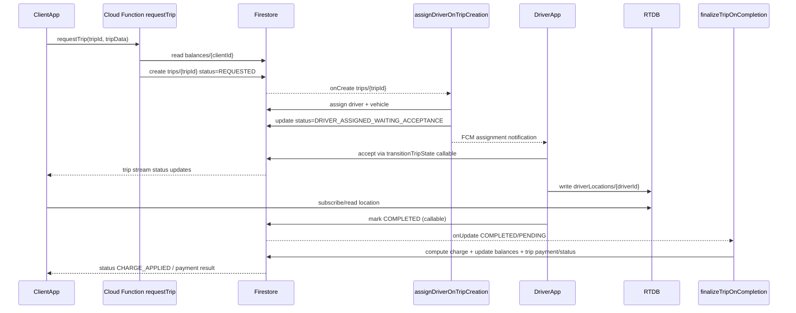
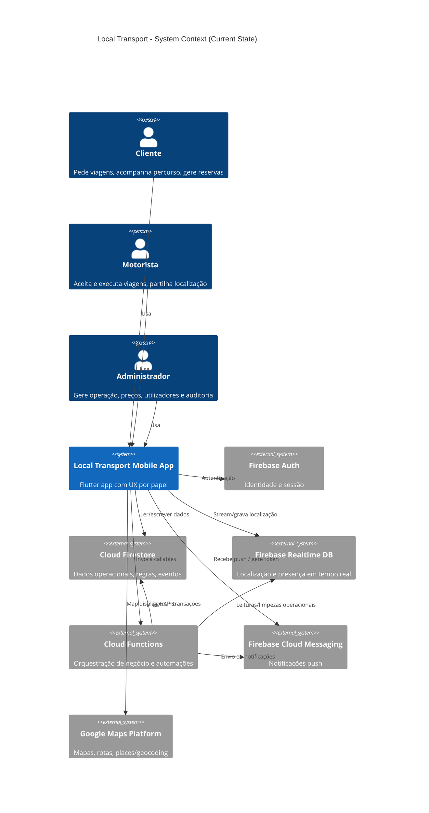

# DEPRECATED — do not use

Documento arquivado para histórico.
Fonte oficial atual: docs/README.md.

# Current State PRD / Business Rules (Static Analysis)

## Executive summary

Local Transport is a role-based internal mobility app where **clients** request and monitor trips, **drivers** execute assigned trips with live location updates, and **admins** manage users, pricing, fleet, balances, events, and operational audit. The current implementation is Firebase-centric: Auth + Firestore + RTDB + Cloud Functions enforce the main operational and financial flows, while Flutter clients orchestrate UX and callable invocations.

### What is implemented vs not implemented (as-is)

**Implemented (evidence-backed):**
- Role-aware routing for `client`, `driver`, `admin` from auth/profile resolution.  
  Evidence: `lib/features/auth/domain/entities/profile_role.dart`, `lib/features/auth/data/repositories/auth_repository_impl.dart`, `lib/app/presentation/role_based_home_shell.dart`.
- Trip request lifecycle with server-side assignment, state transitions, cancellation, extension window, and completion/payment finalization.  
  Evidence: `functions/src/index.ts` (`requestTrip`, `assignDriverOnTripCreation`, `handleTripStatusUpdates`, `finalizeTripOnCompletion`, `autoCompleteTripExtensionWindow`), `functions/src/tripCriticalCallables.ts`.
- Reservations persisted in Firestore and activated daily to trips by scheduler.  
  Evidence: `lib/features/trips/data/repositories/reservation_repository_impl.dart`, `functions/src/index.ts` (`activateReservationsForDay`).
- Balance/debt-limit enforcement in server-side trip request and finalization with consistent `LIMIT_EXCEEDED` semantics.  
  Evidence: `functions/src/index.ts` (`buildLimitExceededDetails`, `throwLimitExceededError`, `requestTrip`, `finalizeTripPayment`).
- Pricing/tariff model with base, distance, duration, waiting, schedules, special days, and multipliers in both app and Functions logic.  
  Evidence: `lib/features/pricing/domain/usecases/resolve_pricing_multiplier.dart`, `lib/features/pricing/domain/usecases/estimate_trip_price.dart`, `functions/src/index.ts` (charge computation helpers and tariff snapshot usage).
- Notifications via FCM token registration + server-side multicast dispatch for trip and event reminders.  
  Evidence: `lib/core/data/firebase/firebase_messaging_initializer.dart`, `firestore.rules` (`users/{uid}/fcmTokens`), `functions/src/index.ts` (`notifyDriver`, `notifyClientTripUpdate`, `sendScheduledEventNotifications`).

**Partially implemented / unclear:**
- Firestore rules allow broad trip document updates for trip participants (`allow update`), while critical transitions are also constrained via callables/state machine; direct client writes may bypass some callable guards if client code writes directly.  
  Evidence: `firestore.rules` (`match /trips/{tripId}`), `functions/src/tripCriticalCallables.ts`.
- Client-side eligibility (`insufficientFunds`) is stricter than server-side projected credit-limit rule and may block requests earlier than backend would.  
  Evidence: `lib/features/client/domain/usecases/validate_trip_eligibility.dart`, `functions/src/index.ts` (`requestTrip`).
- MVP baseline source named in task (“Mvp Scope & Decisions – Firebase…”) is not present as a file in-repo; this diff section uses closest available baseline artifacts.  
  Evidence: repo file inventory + `docs/mvp_qa_checklist.md`, `docs/firebase_functions_inventory.md`.

**Not evidenced in this static pass:**
- Runtime SLA/performance behavior.
- Live Firebase operational data quality.
- Emulator/runtime-only feature flags.

---

## Roles & permissions

### Roles

- **Client**
  - Request trip, observe active trip, cancel where allowed, request extension, approve/reject surcharge, view balances, create/manage reservations, rate trip.
- **Driver**
  - Accept/decline assigned trips, progress trip states, share location/presence, respond to extension requests, propose surcharge.
- **Admin**
  - Manage users, tariffs, transport types, vehicles and assignments, balances/adjustments, audit, events, reports; perform admin callables (e.g., delete user).

### Enforcement model

- **UI-level guards/routing:** Auth destination resolution and route redirection.
  - Evidence: `lib/features/auth/domain/usecases/derive_auth_destination.dart`, `lib/app/presentation/role_based_home_shell.dart`, `lib/app/app.dart`.
- **Firestore/RTDB rules:** Collection-level read/write authorization.
  - Evidence: `firestore.rules`, `database.rules.json`, `storage.rules`.
- **Cloud Functions authorization:** Requester auth + role/ownership checks inside callable and trigger logic.
  - Evidence: `functions/src/index.ts`, `functions/src/tripCriticalCallables.ts`.

### Action → permission matrix

| Action | Client | Driver | Admin | Enforced where | Evidence |
|---|---:|---:|---:|---|---|
| Read own user profile | ✅ | ✅ | ✅ | Firestore rules | `firestore.rules` `match /users/{uid}` |
| Read other driver public profile data | ✅ via `driversPublic/{driverId}` | ✅ scoped public fields only | ✅ | Firestore rules + data split | `firestore.rules` `match /driversPublic/{driverId}` |
| Delete user account + related docs | ❌ | ❌ | ✅ | Callable check + Auth Admin SDK | `functions/src/index.ts` `adminDeleteUser` |
| Request trip | ✅ | ❌ | (indirect) | Callable auth/financial checks | `functions/src/index.ts` `requestTrip` |
| Transition trip state | ✅ (if participant) | ✅ (if participant) | ✅ | Callable ownership/role + state machine | `functions/src/tripCriticalCallables.ts` `transitionTripState` |
| Cancel trip | ✅ (as actor client) | ✅ (as actor driver) | ✅ | Callable actor match + state machine | `functions/src/tripCriticalCallables.ts` `cancelTrip` |
| Read trip | own | assigned | all | Firestore rules | `firestore.rules` `match /trips/{tripId}` |
| Update trip doc directly | participant | participant | admin | Firestore rules (broad) | `firestore.rules` `allow update` |
| Write trip path points | ❌ | ✅ assigned driver | ✅ | Firestore rules | `firestore.rules` `match /trips/{tripId}/pathPoints/{pointId}` |
| Read/write balances | own read only | ❌ | admin write + read | Firestore rules | `firestore.rules` `match /balances/{clientId}` |
| Create balance adjustment | ❌ | ❌ | ✅ | Firestore rules | `firestore.rules` `match /balance_adjustments/{adjustmentId}` |
| Create reservation | ✅ (own) | ❌ | ✅ | Firestore rules | `firestore.rules` `match /reservations/{reservationId}` |
| Update reservation | ✅ (own, constrained) | ❌ | ✅ | Firestore rules | `firestore.rules` `allow update` reservations |
| Driver location write (RTDB) | ❌ | ✅ self | ❌ | RTDB rules | `database.rules.json` `driverLocations/$driverId` |
| Driver presence write (RTDB) | ❌ | ✅ self | ❌ | RTDB rules | `database.rules.json` `driverPresence/$driverId` |
| Register FCM token | ✅ self | ✅ self | ✅ self/admin read-delete | Firestore rules + app initializer | `firestore.rules` `users/{uid}/fcmTokens`, `lib/core/data/firebase/firebase_messaging_initializer.dart` |

### Roles/authz diagram (Mermaid)

---

## Core entities & data model

### Firestore collections (observed)

Primary collections and subcollections used in code/rules/validators:
- `users`, `users/{uid}/fcmTokens`
- `driverStatus`
- `driverVehicleAssignments`
- `vehicles`
- `transport_types`
- `tariffs`
- `pricingSchedules`
- `specialDays`
- `balances`
- `balance_adjustments`
- `audit`
- `trips`, `trips/{tripId}/pathPoints`
- `tripEvents/{tripId}/events`
- `reservations`
- `events`
- operational locks/jobs: `jobs/*` (reservation activation lock)

Evidence: `firestore.rules`; `lib/core/data/firebase/validation/firestore_schema_validator.dart` + validators (`collectionKey`); `functions/src/index.ts`.

### RTDB nodes

- `driverLocations/{driverId}` with geohash (`g`) + coords (`l`) + timestamp (`ts`) and optional heading/speed.
- `driverPresence/{driverId}` with connection state/heartbeat metadata.

Evidence: `database.rules.json`; `lib/core/data/firebase/realtime_db_service.dart`; `lib/features/driver/data/repositories/driver_location_repository_impl.dart`; `lib/features/driver/data/repositories/driver_presence_store_impl.dart`.

### Derived / denormalized fields (examples)

- Trip snapshots embed pricing and transport metadata (`pricingSnapshot`, `transportType`) to preserve historical pricing context.
- Trip lifecycle timestamps (`acceptedAt`, `arrivedAt`, `completedAt`, etc.) are denormalized for analytics/UI timelines.
- Reservation includes `scheduledDayKey` for scheduler filtering.
- Balance docs keep debt-limit values, with legacy compatibility logic in Functions.

Evidence: `functions/src/index.ts` (trip create payload + activation queries + payment logic), `lib/features/trips/data/mappers/trip_firestore_mapper.dart`, `docs/firestore_schema.md`.

### Document ID strategy

- App-generated Firestore IDs for trips/reservations/events/audit/adjustments through `FirestoreService.generateDocumentId(...)` wrappers.
- Trip events use nested path-based id generation (`tripEvents/{tripId}/events`).
- Functions scheduler job lock id format: `activateReservations_{scheduledDayKey}`.

Evidence: `lib/features/trips/data/services/trip_id_generator_impl.dart`; `lib/features/trips/data/services/reservation_id_generator_impl.dart`; `lib/features/events/data/services/scheduled_event_id_generator_impl.dart`; `lib/features/admin/data/repositories/admin_audit_repository_impl.dart`; `functions/src/index.ts` (`activateReservationsForDay`).

### Minimal ER-style diagram

---

## Workflows

## 1) Authentication + onboarding + role routing

**Narrative**
1. User authenticates via Firebase Auth.
2. App resolves role from custom claims, with fallback profile read from `users/{uid}`.
3. Role is mapped to destination route (`/client/dashboard`, `/driver/home`, `/admin/home`).

**Happy path**
- Auth state available + valid role claim/profile → deterministic role route.

**Edge cases**
- Missing profile or unsupported role → profile-missing/error flow.
- Timeout or Firebase errors while resolving role → unauthenticated-safe fallback.

**Notifications / pricing effects**
- None directly.

**Evidence**
- `lib/core/data/firebase/auth_service.dart`
- `lib/features/auth/data/repositories/auth_repository_impl.dart`
- `lib/features/auth/domain/usecases/derive_auth_destination.dart`
- `lib/app/presentation/role_based_home_shell.dart`
- `lib/app/app.dart`

## 2) Trip request → assignment → execution → completion

**Narrative**
1. Client requests trip via callable `requestTrip`.
2. Backend validates projected balance vs credit limit and writes `trips/{tripId}` with `REQUESTED`.
3. `assignDriverOnTripCreation` trigger assigns a candidate driver/vehicle and sets `DRIVER_ASSIGNED_WAITING_ACCEPTANCE`.
4. Driver accepts/declines using `transitionTripState`; declines can trigger reassignment.
5. Driver progresses trip states to completion.
6. Completion triggers payment finalization and balance updates.

**Trip state machine**

**Happy path**
- Request accepted, driver assigned, accepted, route executed, completed, payment applied (`CHARGE_APPLIED`).

**Edge cases**
- No drivers available.
- Driver declines; reassignment attempt.
- Payment fails/limit exceeded on finalization → pending/failed semantics and retry paths.
- Extension window auto-completes after timeout.

**Notifications**
- Driver/client status notifications emitted from backend helper notifications (`notifyDriver...`, `notifyClient...`).

**Billing/pricing effects**
- Initial eligibility check uses estimated amount.
- Final charge computed from metering/fallback + multiplier + discounts + penalties/surcharge.
- Balance adjusted in transaction with debt-limit validation.

**Evidence**
- `functions/src/index.ts` (`requestTrip`, `assignDriverOnTripCreation`, `handleTripStatusUpdates`, `finalizeTripOnCompletion`, `autoCompleteTripExtensionWindow`, notification helpers)
- `functions/src/tripCriticalCallables.ts` (`TRIP_STATE_MACHINE`, `transitionTripState`)
- `lib/features/trips/data/repositories/trip_repository_impl.dart`
- `lib/features/trips/domain/services/trip_state_machine.dart`

## 3) Reservations

**Narrative**
1. Client creates reservation in Firestore.
2. Daily scheduler activates `scheduled` reservations for the current local day.
3. Scheduler picks available driver/vehicle and creates trip from reservation.
4. Reservation transitions to activated/failed/completed-like states depending on execution.

**Happy path**
- `scheduled` reservation at day key → activated trip with assigned resources.

**Edge cases**
- Missing client/route/schedule data.
- No available resources.
- Trip creation failure.

**Notifications**
- Client can be notified on reservation activation/update from Functions notification helpers.

**Billing/pricing effects**
- Trip created with tariff snapshot at activation.

**Evidence**
- `lib/features/trips/data/repositories/reservation_repository_impl.dart`
- `lib/features/trips/domain/services/reservation_policy.dart`
- `functions/src/index.ts` (`activateReservationsForDay`, `createTripFromReservation`, `markReservationFailed`)
- `firestore.rules` (`match /reservations/{reservationId}`)

## 4) Cancellations / no-show logic

**Narrative**
- Cancellation callable resolves target status by actor/type and enforces transition legality.
- Writes cancellation payload with actor/type/fee/reason and emits trip event + audit entry.

**Happy path**
- Authorized actor cancels within valid source state.

**Edge cases**
- Invalid actor/type, invalid source-state transition, unauthorized requester.
- No-show mapped from `type == noShow`.

**Notifications**
- Status updates can propagate to participant notifications via triggers/helpers.

**Billing effects**
- Cancellation fee captured in trip cancellation object and may influence downstream charging/reporting.

**Evidence**
- `functions/src/tripCriticalCallables.ts` (`cancelTrip`, state machine)
- `lib/features/trips/domain/services/trip_cancellation_policy.dart`
- `firestore.rules` trip/tripEvents access rules

## 5) Balance / debt blocking

**Narrative**
- Before trip creation, backend computes projected balance after estimated debit and denies if below allowed credit floor.
- On completion/finalization, backend recalculates and validates again before applying charge.

**Happy path**
- Balance remains within limit after request and final charge.

**Edge cases**
- Missing balance doc.
- `LIMIT_EXCEEDED` at request or payment retry/finalization.
- Legacy debt field compatibility handled server-side.

**Client-side pre-check nuance**
- App performs pre-check (`blockedByDebtLimit`, `insufficientFunds`) that may reject earlier than backend’s projected-limit logic.

**Evidence**
- `functions/src/index.ts` (`requestTrip`, `resolveCreditLimitMinor`, `isBalanceWithinCreditLimit`, `finalizeTripPayment`)
- `lib/features/client/domain/entities/balance.dart`
- `lib/features/client/domain/usecases/validate_trip_eligibility.dart`
- `firestore.rules` (`balances`, `balance_adjustments`)

## 6) Pricing / tariff multipliers

**Narrative**
- Base tariff and dynamic multipliers are resolved from schedule and optional special-day override.
- Trip estimates in app combine base+distance+duration with selected multiplier.
- Finalization applies metering + penalty/surcharge/discount logic server-side.

**Happy path**
- Active schedule/special day produce effective multiplier and accurate estimate/charge.

**Edge cases**
- No active schedule defaults to 1.0.
- Multiple schedule matches choose highest coefficient.

**Evidence**
- `lib/features/pricing/domain/usecases/resolve_pricing_multiplier.dart`
- `lib/features/pricing/domain/usecases/estimate_trip_price.dart`
- `lib/features/pricing/data/repositories/*`
- `functions/src/index.ts` (trip pricing snapshot and final charge computation)
- `firestore.rules` (`tariffs`, `pricingSchedules`, `specialDays`)

## 7) Admin operations

**Implemented admin areas (UI + data):**
- User management, transport types, tariffs, fleet/vehicle assignment, balances and adjustments, audit trail, events, reports.

**Server-side admin-only operations:**
- `adminDeleteUser` callable and admin-protected collection writes in rules.

**Evidence**
- UI: `lib/features/admin/presentation/screens/*`
- Data: `lib/features/admin/data/repositories/*`
- Rules: `firestore.rules` for admin-only collections
- Functions: `functions/src/index.ts` (`adminDeleteUser`)

---

## Sequence diagram (key trip flow)

---

## Business rules catalog

> Note: `BR-###` statements reflect implemented code behavior, not target behavior.

- **BR-001 — Auth required for all critical trip callables.**  
  Enforced: Cloud Functions (callables).  
  Data impacted: `trips`, `tripEvents`, `audit`.  
  Evidence: `functions/src/index.ts` (`requestTrip`, `retryTripPayment`); `functions/src/tripCriticalCallables.ts`.

- **BR-002 — Only admin can call admin user deletion.**  
  Enforced: callable role check + Firestore read of requester role.  
  Data impacted: Auth users + `users`, `balances`, `driverStatus`, `driverVehicleAssignments`, RTDB `driverLocations`.  
  Evidence: `functions/src/index.ts` (`adminDeleteUser`).

- **BR-003 — Trip request blocked if projected balance breaches credit limit.**  
  Enforced: server-side in `requestTrip`.  
  Data impacted: trip creation allowed/denied.  
  Evidence: `functions/src/index.ts` (`resolveCreditLimitMinor`, `isBalanceWithinCreditLimit`, `throwLimitExceededError`, `requestTrip`).

- **BR-004 — Trip status transitions must follow state machine.**  
  Enforced: callable transaction guard.  
  Data impacted: `trips.status`, `tripEvents`.  
  Evidence: `functions/src/tripCriticalCallables.ts` (`TRIP_STATE_MACHINE`, `assertTransitionAllowed`).

- **BR-005 — Participant ownership required for transition/cancel unless admin.**  
  Enforced: callable user-vs-client/driver checks.  
  Data impacted: `trips`, `tripEvents`, `audit`.  
  Evidence: `functions/src/tripCriticalCallables.ts` (`transitionTripState`, `cancelTrip`).

- **BR-006 — Completion triggers payment finalization workflow.**  
  Enforced: Firestore trigger on status/payment transitions.  
  Data impacted: `trips.payment*`, `balances`, `balance_adjustments`, `audit/events`.  
  Evidence: `functions/src/index.ts` (`finalizeTripOnCompletion`, `finalizeTripPayment`).

- **BR-007 — Extension request only by client in arrived/extension states; response only by assigned driver with pending request.**  
  Enforced: callable guards.  
  Data impacted: trip extension fields + events/audit.  
  Evidence: `functions/src/tripCriticalCallables.ts` (`requestTripExtension`, `respondTripExtension`).

- **BR-008 — Manual surcharge can be proposed by assigned driver and resolved by client.**  
  Enforced: callable action checks.  
  Data impacted: `trips.manualSurcharge`, trip events, audit.  
  Evidence: `functions/src/tripCriticalCallables.ts` (`handleTripFinancialAction`).

- **BR-009 — Daily scheduler activates reservations at/after local 05:00 with lock to avoid duplicate runs.**  
  Enforced: scheduler + `jobs` lock document.  
  Data impacted: `reservations`, `trips`, `jobs`.  
  Evidence: `functions/src/index.ts` (`activateReservationsForDay`).

- **BR-010 — RTDB driver location is writeable only by the same authenticated driver id.**  
  Enforced: RTDB rules.  
  Data impacted: `driverLocations/{driverId}`.  
  Evidence: `database.rules.json`.

- **BR-011 — Firestore balances are admin-write only; client can only read own balance.**  
  Enforced: Firestore security rules.  
  Data impacted: `balances`.  
  Evidence: `firestore.rules` (`match /balances/{clientId}`).

- **BR-012 — Reservations creation/update ownership constraints apply to clients; admin override allowed.**  
  Enforced: Firestore rules.  
  Data impacted: `reservations`.  
  Evidence: `firestore.rules` (`match /reservations/{reservationId}`).

---

## Integrations & infrastructure

### Firebase services used

- **Firebase Auth**: sign-in/reset/current user/token claims.  
  Evidence: `lib/core/data/firebase/auth_service.dart`.
- **Cloud Firestore**: primary operational state and entities.  
  Evidence: `lib/core/data/firebase/firestore_service.dart`, `firestore.rules`.
- **Realtime Database**: live driver location + connection/presence.  
  Evidence: `lib/core/data/firebase/realtime_db_service.dart`, `database.rules.json`.
- **Cloud Functions**: business-critical orchestrations and automation.  
  Evidence: `functions/src/index.ts`, `functions/src/tripCriticalCallables.ts`.
- **FCM**: user token registration and push notifications.  
  Evidence: `lib/core/data/firebase/firebase_messaging_initializer.dart`, `functions/src/index.ts` notification helpers.
- **Firebase Storage**: admin/user media uploads (fleet/user photos).  
  Evidence: `lib/core/data/firebase/firebase_storage_service.dart`, admin upload use cases/repositories.

### Cloud Functions inventory (exported)

- Callable: `requestTrip`, `adminDeleteUser`, `retryTripPayment`, `transitionTripState`, `cancelTrip`, `requestTripExtension`, `respondTripExtension`, `handleTripFinancialAction`.
- Firestore triggers: `assignDriverOnTripCreation`, `syncDriverVehicleAssignment`, `handleTripStatusUpdates`, `finalizeTripOnCompletion`, `autoCompleteTripExtensionWindow`, `notifyDriverOnAdminEventCreation`.
- Scheduled: `activateReservationsForDay`, `sendScheduledEventNotifications`, `monitorDriverHeartbeat`, `sweepDriverAcceptanceTimeouts`.

Evidence: `functions/src/index.ts` export list.

### Google Maps usage

- **Map display/UI**: `google_maps_flutter` in client/driver screens.
- **Route estimation**: Google Directions API data source used for route distance/duration/polyline.
- **Places/geocoding**: Google Places API client for autocomplete/details/geocode.

Evidence: `lib/features/*/presentation/screens/*` (GoogleMap usage), `lib/features/trips/data/services/google_directions_route_data_source.dart`, `lib/core/data/network/google_places_api_client.dart`, `lib/app/config/environment_config.dart`.

---

## Known gaps / ambiguities (from static analysis)

1. **Baseline MVP document referenced in task is not present in repository** under a matching filename; diff is therefore based on closest in-repo MVP artifacts (`docs/mvp_qa_checklist.md`, `docs/firebase_functions_inventory.md`).
2. **Potential dual-enforcement gap for trip updates:** Firestore rules permit participant updates to trip docs broadly, while stricter transition/cancel rules exist in callables; static analysis cannot prove all client writes always go through callables.
3. **Client-side eligibility mismatch risk:** app checks `balance < estimatedTotal` and debt-limit threshold differently from backend projected-limit model, potentially producing UX discrepancies.
4. **Some docs may lag code:** `docs/ARCHITECTURE_NOTES.md` references older conventions; runtime verification needed before treating as authoritative.
5. **No runtime validation in this task:** no emulator/live checks performed (intentional per scope).

---

## Differences vs MVP baseline doc(s)

> Since “Mvp Scope & Decisions – Firebase…” was not found in-repo, this section compares with available MVP-oriented docs: `docs/mvp_qa_checklist.md` and `docs/firebase_functions_inventory.md`.

### Matches
- End-to-end client→driver→completion flow exists with reassignment/cancel/no-show/extension scenarios represented in code and QA checklist.
- Reservation activation scheduler and key function inventory align with listed MVP operational flows.
- Balance limit error contract (`LIMIT_EXCEEDED`) aligns with inventory documentation.

### Differences / clarifications
- Codebase has richer admin modules (audit/events/reports/fleet/balance adjustment) than a minimal trip-only MVP framing.
- Enforcement split is mixed: some constraints in client/domain checks, some in rules, some in callables.
- State machine details in code include terminal nuances (`NO_DRIVERS_AVAILABLE`, `CHARGE_APPLIED`) that may need explicit baseline wording if absent.

### Unknowns
- Any scope clauses from the missing baseline doc cannot be confirmed.

---

## How to extend safely (change impact guide)

- **If adding a trip status**, update at minimum:
  - Domain enum and state machine (`TripState`, `TripStateMachine`)
  - Firestore mapper conversions
  - Cloud Functions status validation + transition state machine
  - Security rule status normalization helpers (if used)
  - UI filters/status labels and report queries
  - Evidence: `lib/features/trips/domain/entities/trip_state.dart`, `lib/features/trips/domain/services/trip_state_machine.dart`, `lib/features/trips/data/mappers/trip_firestore_mapper.dart`, `functions/src/index.ts`, `functions/src/tripCriticalCallables.ts`, `firestore.rules`.

- **If changing pricing logic**, update both:
  - Client estimate domain use cases
  - Server-side final charge computation and payment finalization
  - Tariff/schedule/special-day repositories/mappers
  - Evidence: `lib/features/pricing/domain/usecases/*`, `functions/src/index.ts`.

- **If changing debt/balance policy**, update:
  - Backend eligibility/finalization checks and error contract
  - Client pre-check use cases/messages
  - Firestore schema docs + any admin adjustment workflows
  - Evidence: `functions/src/index.ts`, `lib/features/client/domain/usecases/validate_trip_eligibility.dart`, `docs/firestore_schema.md`.

- **If changing role permissions**, update:
  - Firestore rules + RTDB rules
  - Callable role checks
  - Auth routing / destination mapping
  - Admin UI guards and repositories
  - Evidence: `firestore.rules`, `database.rules.json`, `functions/src/index.ts`, `lib/app/presentation/role_based_home_shell.dart`.

---

## C4 context diagram (Mermaid)

---

## Notes on evidence quality

- All behavioral claims above are tied to static evidence in source/rules/docs.
- Any statement that requires runtime confirmation is labeled as gap/unknown.

