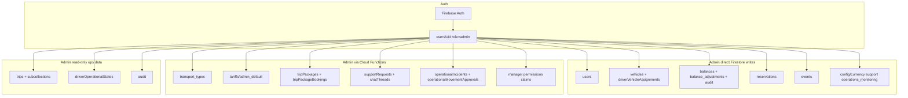
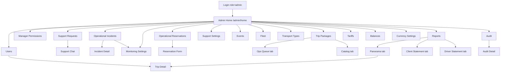

# Admin — Firebase collections & screen map

Project: **local_transport** (reference app)  
Role in Firestore: `users/{uid}.role = "admin"`  
Code: `lib/features/admin/` + shared feature screens (incidents, packages, support, reports)

---

## Quick summary (বাংলায়)

| কাজ | Screen | Firebase |
|-----|--------|----------|
| Admin hub | Admin Home | `config/*`, `tariffs/*` (health check) |
| User management | Admin Users | `users`, `driverStatus`, `balances`, `vehicles`, `driverVehicleAssignments`, `trips` |
| Fleet / cars | Admin Fleet | `vehicles`, `driverVehicleAssignments`, `users`, `transport_types` |
| Pricing | Admin Tariffs | `tariffs/admin_default`, `transport_types` |
| Transport types | Admin Transport Types | `transport_types` |
| Client balances | Admin Balances | `balances`, `balance_adjustments`, `audit`, `users` |
| Reports | Admin Reports | `trips`, `balance_adjustments`, `users` |
| Audit log | Admin Audit | `audit` |
| Reservations | Operational Reservations | `reservations`, `users` |
| Trip packages | Trip Packages | `tripPackages`, `tripPackageBookings` |
| Support tickets | Support Requests | `supportRequests`, `chatThreads` |
| Incidents | Operational Incidents | `operationalIncidents`, `driverOperationalStates` |
| Events / notifications | Admin Events | `events`, `users` |
| Manager permissions | Manager Permissions | `users` |
| Currency FX | Currency Settings | `config/currency` |
| Support phone | Support Settings | `config/support` |
| Monitoring rules | Monitoring Settings | `config/operations_monitoring` |

**Auth:** Firebase Auth (email/password) + custom claims `role=admin`  
**Storage:** profile photos, vehicle photos, package photos  
**RTDB:** admin screens do **not** read RTDB directly (backend processes `driverLocations` → Firestore `driverOperationalStates`)

---

## Architecture



---

## Admin screen list (all routes)

### Main modules (from Admin Home)

| # | Screen | Route | File | Purpose |
|---|--------|-------|------|---------|
| 1 | **Admin Home** | `/admin/home` | `lib/features/admin/presentation/screens/admin_home_shell.dart` | Module hub; missing-config warning banner |
| 2 | **Users** | `/admin/users` | `admin_users_screen.dart` | CRUD all roles (client, driver, manager, admin); password reset; driver vehicle assign; ratings |
| 3 | **Manager Permissions** | `/admin/manager-permissions` | `admin_manager_permissions_screen.dart` | Set manager permission flags (custom claims) |
| 4 | **Support Requests** | `/ops/support-requests` | `support_requests_screen.dart` | Password-help & support ticket inbox |
| 5 | **Operational Incidents** | `/admin/operational-incidents` | `operational_incidents_screen.dart` | Driver monitoring incidents; reposition approval |
| 6 | **Monitoring Settings** | `/admin/operational-monitoring-settings` | `operational_monitoring_settings_screen.dart` | Thresholds for operational monitoring |
| 7 | **Operational Reservations** | `/ops/reservations` | `operational_reservations_screen.dart` | Internal staff reservations list |
| 8 | **Support Settings** | `/admin/support-settings` | `admin_support_settings_screen.dart` | Support phone / contact config |
| 9 | **Events** | `/admin/events` | `admin_events_screen.dart` | Schedule broadcast notifications to drivers |
| 10 | **Fleet** | `/admin/fleet` | `admin_fleet_screen.dart` | Vehicle CRUD; assign driver ↔ vehicle |
| 11 | **Transport Types** | `/admin/transport-types` | `admin_transport_types_screen.dart` | Create/edit transport categories & base fares |
| 12 | **Trip Packages** | `/admin/trip-packages` | `trip_package_workspace_screen.dart` | 2 tabs: Ops queue + Catalog |
| 13 | **Tariffs** | `/admin/tariffs` | `admin_tariffs_screen.dart` | Edit `admin_default` tariff (distance tiers, multipliers) |
| 14 | **Balances** | `/admin/balances` | `admin_balances_screen.dart` | Client wallet balances; manual adjustments |
| 15 | **Currency Settings** | `/admin/currency-settings` | `admin_currency_settings_screen.dart` | CVE → EUR/USD exchange rates |
| 16 | **Reports** | `/admin/reports` | `admin_reports_screen.dart` | 3 tabs: Panorama, Client statement, Driver statement |
| 17 | **Audit** | `/admin/audit` | `admin_audit_screen.dart` | Filterable audit log |
| 18 | **Settings** | `/settings` | `settings_screen.dart` | Language, password, sign out (shared) |

### Sub-screens & deep links

| Screen | Route | File | Opens from |
|--------|-------|------|------------|
| **Reservation Form** | `/ops/reservations/new`, `/ops/reservations/edit` | `operational_reservation_form_screen.dart` | Operational Reservations |
| **Incident Detail** | `/admin/operational-incidents/{id}` | `operational_incident_detail_screen.dart` | Incidents list |
| **Support Chat** | `/ops/support-requests/{id}` | `support_request_chat_screen.dart` | Support Requests |
| **Audit Detail** | (push, no named route) | `admin_audit_detail_screen.dart` | Audit list |
| **Trip Detail** | `/manager/trips/{tripId}` | `manager_trip_detail_screen.dart` | Users, Reports (admin has full access) |
| **Trip Package Ops tab** | (tab inside workspace) | `trip_package_ops_queue_screen.dart` | Trip Packages |
| **Trip Package Catalog tab** | (tab inside workspace) | `trip_package_management_screen.dart` | Trip Packages |
| **Reports: Panorama tab** | (tab) | `admin_operational_panorama_tab.dart` | Reports |
| **Reports: Client Statement tab** | (tab) | `admin_client_statement_tab.dart` | Reports |
| **Reports: Driver Statement tab** | (tab) | `admin_driver_statement_tab.dart` | Reports |

### Modal sheets (no route — opened from parent)

| Sheet | File | Parent screen |
|-------|------|---------------|
| User create/edit | `admin_user_form_sheet.dart` | Users |
| Assign vehicle to driver | `admin_assign_vehicle_sheet.dart` | Users, Fleet |
| Assign driver to vehicle | `admin_assign_driver_sheet.dart` | Fleet |
| Driver technical details | `admin_driver_technical_details_sheet.dart` | Users |
| Driver ratings | `driver_ratings_sheet.dart` | Users |
| Vehicle form | `admin_vehicle_form_sheet.dart` | Fleet |
| Transport type form | `admin_transport_type_form_sheet.dart` | Transport Types |
| Balance adjustment | `admin_balance_adjustment_sheet.dart` | Balances |
| Event driver picker | `admin_event_driver_target_picker_sheet.dart` | Events |
| Reposition approval | `operational_reposition_approval_sheet.dart` | Incidents |
| Incident review | `operational_incident_review_sheet.dart` | Incident Detail |
| Package template form | `trip_package_form_sheet.dart` | Trip Packages |

---

## Screen → Firebase mapping (detailed)

| Screen | Firestore collections | Storage | Cloud Functions | Auth |
|--------|----------------------|---------|-----------------|------|
| **Admin Home** | Read: `config/cancellation_policy_admin`, `config/currency`, `config/operations_monitoring`, `config/support`, `tariffs/admin_default`, `tariffs/public_default` | — | — | session |
| **Users** | Read/Write: `users`, `driverStatus`, `balances` (on client create). Read: `vehicles`, `driverVehicleAssignments`, `trips` (ratings) | `users/{uid}/profile.{ext}` | `adminUpdateUserPassword`, `adminDeleteUser` | create user |
| **Manager Permissions** | Read: `users` (managers) | — | `setManagerPermissions` | — |
| **Support Requests** | Read: `supportRequests` | — | `resolvePasswordHelpRequest` | — |
| **Support Chat** | Read: `supportRequests`, `chatThreads`, `chatThreads/.../chatMessages` | — | `sendSupportTicketMessage` | — |
| **Support Settings** | Read/Write: `config/support` | — | — | — |
| **Operational Incidents** | Read: `operationalIncidents`, `driverOperationalStates`, `operationalMovementApprovals` | — | `approveOperationalReposition` | — |
| **Incident Detail** | Read: `operationalIncidents/{id}`, `operationalIncidents/{id}/events` | — | `reviewOperationalIncident` | — |
| **Monitoring Settings** | Read/Write: `config/operations_monitoring` | — | — | — |
| **Operational Reservations** | Read/Write: `reservations`. Read: `users` | — | — | — |
| **Reservation Form** | Write: `reservations`. Read: `users`, `transport_types` | — | — | — |
| **Events** | Write: `events`. Read: `users` (drivers) | — | — | — |
| **Fleet** | Read/Write: `vehicles`, `driverVehicleAssignments`. Read: `users`, `transport_types` | `vehicles/{id}/photo.{ext}` | — | — |
| **Transport Types** | Read: `transport_types` | — | `createTransportType`, `updateTransportType` | — |
| **Trip Packages (Catalog)** | Read: `tripPackages` | `tripPackages/{id}/photo.{ext}` | `saveTripPackageTemplate`, `archiveTripPackageTemplate`, `deleteTripPackageTemplate` | — |
| **Trip Packages (Ops)** | Read: `tripPackageBookings` | — | `approveTripPackageBooking`, `rejectTripPackageBooking` | — |
| **Tariffs** | Read: `tariffs/admin_default`, `transport_types` | — | `saveAdminTariff` | — |
| **Balances** | Read/Write: `balances`, `balance_adjustments`, `audit`. Read: `users` | — | — | — |
| **Currency Settings** | Read/Write: `config/currency` | — | — | — |
| **Reports (all tabs)** | Read: `trips`, `balance_adjustments`, `users` | — | — (export is client-side CSV/XLSX) | — |
| **Audit** | Read: `audit` | — | `resolveAuditAdminEmails`, `resolveAuditSubjectIdentities` | — |
| **Trip Detail** | Read: `trips/{id}`, `trips/{id}/pathPoints`, `trips/{id}/metering`, `trips/{id}/driverContactSnapshots`, `tripEvents/{id}/events` | — | — | — |
| **Settings** | — | — | — | password change, sign out |

---

## All Firestore collections admin uses

### Write access (direct from app or via CF)

| Collection | Admin can | Typical fields / notes |
|------------|-----------|------------------------|
| `users/{uid}` | CRUD | `role`, `name`, `email`, `phone`, `isActive`, `managerPermissions` |
| `driverStatus/{driverId}` | CRUD | `isActive`, `isAvailable`, `currentTripId`, `vehicleId` |
| `driverVehicleAssignments/{driverId}` | CRUD | `vehicleId` |
| `vehicles/{vehicleId}` | CRUD | `model`, `plate`, `capacity`, `isActive`, `defaultTransportType` |
| `balances/{clientId}` | Read/Write | `amountMinor`, `currency` |
| `balance_adjustments/{id}` | CRUD | manual balance corrections |
| `audit/{entryId}` | CRUD | action log (tariff, balance, etc.) |
| `reservations/{id}` | CRUD | internal staff bookings |
| `events/{eventId}` | CRUD | scheduled driver notifications |
| `trips/{tripId}` | Read/Write | full trip admin support |
| `trips/.../pathPoints` | Write | GPS trail |
| `trips/.../metering` | Write | live meter |
| `trips/.../driverContactSnapshots` | Write | contact snapshots |
| `pricingSchedules/{id}` | CRUD | pricing schedules |
| `specialDays/{id}` | CRUD | special day pricing |
| `driversPublic/{driverId}` | Write | public driver card |
| `config/cancellation_policy_admin` | Read/Write | cancellation rules |
| `config/currency` | Read/Write | `cveToEur`, `cveToUsd` |
| `config/support` | Read/Write | `supportPhone` |
| `config/operations_monitoring` | Read/Write | monitoring thresholds |

### Read-only in app (writes via Cloud Functions / backend)

| Collection | Used by screen | CF / server |
|------------|--------------|-------------|
| `transport_types/{id}` | Transport Types, Fleet, Tariffs, Reservations | `createTransportType`, `updateTransportType` |
| `tariffs/admin_default` | Tariffs, Home health check | `saveAdminTariff` |
| `tariffs/public_default` | Home health check | server mirror |
| `tripPackages/{id}` | Trip Packages catalog | `saveTripPackageTemplate`, etc. |
| `tripPackageBookings/{id}` | Trip Packages ops | `approveTripPackageBooking`, `rejectTripPackageBooking` |
| `tripPackageBookingOperations/{id}` | backend ops log | server |
| `supportRequests/{id}` | Support Requests | `resolvePasswordHelpRequest` |
| `chatThreads/{id}` + `chatMessages` | Support Chat | `sendSupportTicketMessage` |
| `operationalIncidents/{id}` | Incidents | server + `reviewOperationalIncident` |
| `operationalIncidents/.../events` | Incident Detail | server |
| `operationalMovementApprovals/{id}` | Incidents | `approveOperationalReposition` |
| `driverOperationalStates/{driverId}` | Incidents | derived from RTDB pipeline |
| `tripOperationalMetrics/{tripId}` | Reports / trip detail | server |
| `tripEvents/{tripId}/events` | Trip detail | server |
| `userRuntime/{uid}` | backend runtime | server |
| `notificationTargets` | backend notifications | server |
| `jobs` | backend jobs | server |

---

## Firebase Storage (admin writes)

| Path | Screen |
|------|--------|
| `users/{userId}/profile.{jpg\|png\|webp}` | Admin Users |
| `vehicles/{vehicleId}/photo.{ext}` | Admin Fleet |
| `tripPackages/{packageId}/photo.{ext}` | Trip Packages catalog |

---

## Cloud Functions (admin callables)

| Function | Screen / feature |
|----------|------------------|
| `adminUpdateUserPassword` | Users — password reset |
| `adminDeleteUser` | Users — delete account |
| `setManagerPermissions` | Manager Permissions |
| `createTransportType` | Transport Types — create |
| `updateTransportType` | Transport Types — update |
| `saveAdminTariff` | Tariffs — save |
| `resolvePasswordHelpRequest` | Support Requests — resolve |
| `sendSupportTicketMessage` | Support Chat — reply |
| `reviewOperationalIncident` | Incident Detail — acknowledge/dismiss/confirm |
| `approveOperationalReposition` | Incidents — reposition approval |
| `saveTripPackageTemplate` | Trip Packages — save template |
| `archiveTripPackageTemplate` | Trip Packages — archive |
| `deleteTripPackageTemplate` | Trip Packages — delete |
| `approveTripPackageBooking` | Trip Packages ops — approve |
| `rejectTripPackageBooking` | Trip Packages ops — reject |
| `resolveAuditAdminEmails` | Audit — admin email labels |
| `resolveAuditSubjectIdentities` | Audit — subject identity labels |

---

## Realtime Database

Admin UI does **not** read RTDB nodes directly.

| RTDB node | Backend use | Firestore mirror admin reads |
|-----------|-------------|------------------------------|
| `driverLocations/{driverId}` | live GPS | `driverOperationalStates` (incidents) |
| `driverPresence/{driverId}` | online heartbeat | processed server-side |

---

## Navigation flow



---

## Admin vs Manager

Admin bypasses all manager permission guards. Managers share some screens with limited permissions:

| Shared screen | Manager needs permission |
|---------------|-------------------------|
| Support Requests | `vs` |
| Operational Reservations | operational permission |
| Trip Packages | `tp` |
| Tariffs | `mt` |
| Reports | reporting permissions |
| Trip chat (read-only) | `ch` |
| Drivers list | `vd` |

Full permission matrix: `docs/ops/manager_permissions_query_safety_matrix.md`

---

## Related docs

| File | Content |
|------|---------|
| `docs/source_of_truth/admin.md` | Full admin domain spec (Portuguese) |
| `docs/firestore_schema.md` | Collection schemas |
| `docs/firebase_functions_inventory.md` | All Cloud Functions |
| `docs/as_is/data_sources.md` | Data layer overview |
| `firestore.rules` | Security rules (`isAdmin()`) |

---

## Bootstrap admin account

```bash
# From local_transport/functions — creates Auth user + users/{uid} with role=admin
npm run seed:admin
```

See `docs/ops/local_seed_users.md` for test accounts.
