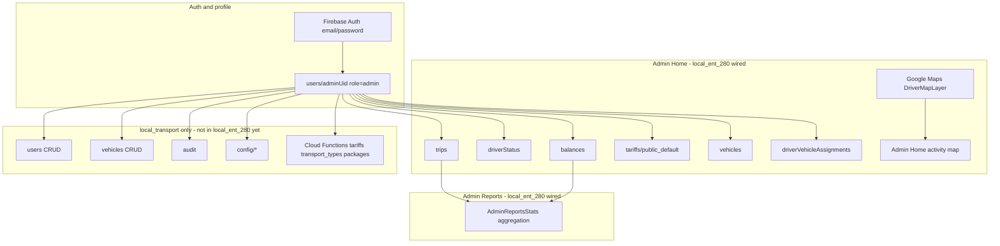

# Admin — Firebase collections map

Project: **local-transport-482015**  
Apps: **local_ent_280** (production UI + full backend in-repo) · **local_transport** (original reference app, same backend source)

> Backend assets (functions, docs, indexes, rules-test, CI) are now included in **local_ent_280**. See root `README.md`.

Screenshots in this folder (`Screenshot_3.png`, `image.png`) show the live Firestore console and the admin UI mockups (Premium Mobility dashboard + Detailed Reports).

Full screen inventory for the reference app: [`local_transport/docs/admin-firebase-screens.md`](../../local_transport/docs/admin-firebase-screens.md)

---

## Quick summary (বাংলায়)

| কাজ | Screen | Collection |
|-----|--------|------------|
| Admin login | Auth | `users/{uid}.role = "admin"` |
| Dashboard — active trips | Admin Home | `trips` (`isActive`, `status`) |
| Dashboard — available drivers | Admin Home | `driverStatus` (`isAvailable`, `isActive`) |
| Dashboard — pending debt | Admin Home / Reports | `balances` (negative `amountMinor`) |
| Dashboard — base rate | Admin Home | `tariffs/public_default` |
| Dashboard — recent fleet | Admin Home | `vehicles`, `driverVehicleAssignments`, `users`, `driverStatus` |
| Dashboard — activity map | Admin Home | `trips` (active pickups) + `driverOperationalStates` (`latestLocation`) + `config/market` (`activityMapLabel`) |
| Dashboard — fuel cost | Admin Home | `config/market` (`fuelCostPerLiter`) |
| Reports — totals | Admin Reports | `trips` (`meteringSnapshot`, `COMPLETED`) |
| Reports — activities | Admin Reports | `trips` (latest completed) |
| Reports — fleet efficiency | Admin Reports | `trips` (assigned vs completed ratio) |

**local_ent_280 today:** Admin Home + Detailed Reports are **wired to Firebase** via `AdminRepository`. Export, date-range picker, and the 16 other admin modules from `local_transport` are **not** implemented yet.

---

## Architecture (data flow)



---

## Screens implemented in local_ent_280

| Screen | File | Firebase source |
|--------|------|-----------------|
| **Admin Home** | `lib/presentation/admin/admin_home_screen.dart` | `AdminRepository` (dashboard, map, fleet) |
| **Detailed Reports** | `lib/presentation/admin/admin_reports_screen.dart` | `AdminRepository.watchReportsStats()` |
| **Administration hub** | `lib/presentation/admin/screens/admin_hub_screen.dart` | Navigation to all modules |
| **Users** | `lib/presentation/admin/screens/admin_users_screen.dart` | `users` (read + toggle `isActive`) |
| **Manager permissions** | `lib/presentation/admin/screens/admin_manager_permissions_screen.dart` | `users` (`role=manager`, `managerPermissions`) |
| **Support tickets** | `lib/presentation/admin/screens/admin_support_requests_screen.dart` | `supportRequests` (read) |
| **Operational incidents** | `lib/presentation/admin/screens/admin_operational_incidents_screen.dart` | `operationalIncidents` (read) |
| **Incident detail** | `lib/presentation/admin/screens/admin_incident_detail_screen.dart` | `operationalIncidents/{id}` + map |
| **Fleet** | `lib/presentation/admin/screens/admin_module_screens.dart` | `vehicles`, assignments, `users` |
| **Sales / Balances** | same | `balances`, `users` |
| **Audit** | same | `audit` |
| **Events** | same | `events` |
| **Reservations** | same | `reservations` |
| **Transport types** | same | `transport_types` (read) |
| **Trip packages** | same | `tripPackages` (read) |
| **Tariffs** | same | `tariffs/admin_default`, `tariffs/public_default` (read) |
| **Currency settings** | same | `config/currency` (read/write) |
| **Support settings** | same | `config/support` (read/write) |
| **Monitoring settings** | same | `config/operations_monitoring` (read) |

Drawer: `lib/presentation/admin/admin_drawer.dart` — links to all modules above.

### Admin Home sections → Firestore fields

| UI section | Metric | Query / field |
|------------|--------|---------------|
| Active Trips | Count | `trips` where `isActive == true` or status in active set (`REQUESTED`, `IN_TRIP`, etc.) |
| Available Drivers | Count | `driverStatus` where `isAvailable == true` and `isActive != false` |
| Active trips trend | % vs yesterday | Compare today's active count vs yesterday (client-side) |
| Pending Debtors | Amount + count | `balances` docs with negative `amount.amountMinor` |
| Activity Map | Map | `DriverMapLayer` (same as driver screens) |
| Base Rate | €/km | `tariffs/public_default.perKm.amountMinor` |
| Dynamic badge | Multiplier | `tariffs/public_default.multiplierRules[0].multiplier` |
| Recent Fleet | Vehicle + driver + status | `vehicles` + `driverVehicleAssignments` + `users` + `driverStatus.currentTripId` |

### Detailed Reports → Firestore fields

| UI metric | Source |
|-----------|--------|
| Total Trips (month) | `trips` with `status == COMPLETED` in current month |
| Trips trend badge | Month-over-month completed trip count |
| Total Distance | Sum `meteringSnapshot.totalDistanceKm` (month completed) |
| Time on Route | Sum `meteringSnapshot.totalMinutes` → hours |
| Total Cost | Sum `meteringSnapshot.estimatedCostMinor` → EUR |
| Pending Debt | Sum negative `balances.amount.amountMinor` |
| Latest Activities | Last 5 completed trips (destination, id, time, fare) |
| Fleet Efficiency | % of completed trips that had `assignedDriverId` |

---

## Collections used by admin role

### 1. `users/{uid}` — admin account (required)

| Field | Type | Example |
|-------|------|---------|
| `role` | string | `"admin"` |
| `name` | string | `"Admin User"` |
| `email` | string | `"admin@test.com"` |
| `isActive` | bool | `true` |

**Who writes:** register / admin CRUD (local_transport).  
**local_ent_280:** read own profile; admin CRUD not implemented.

---

### 2. `trips/{tripId}` — operations overview (required)

| Field | Type | Used for |
|-------|------|----------|
| `status` | string | Active vs completed filtering |
| `isActive` | bool | Active trip count |
| `assignedDriverId` | string? | Fleet efficiency, unassigned trips |
| `clientId` | string | Client reference |
| `clientSupport` | map | Display name / phone |
| `pickup` / `destination` | map | Addresses + coordinates |
| `meteringSnapshot` | map | Distance, minutes, cost aggregates |
| `createdAt` / `completedAt` / `updatedAt` | timestamp | Trends, activity list |

**Example `meteringSnapshot`:**

```json
{
  "estimatedCostMinor": 1250,
  "totalDistanceKm": 12.4,
  "totalMinutes": 28,
  "totalWaitMinutes": 3
}
```

**local_ent_280:** `AdminRepository.watchTrips()` — last 200 trips, sorted by `createdAt`.

---

### 3. `driverStatus/{driverUid}` — fleet availability

| Field | Type | Used for |
|-------|------|----------|
| `isAvailable` | bool | Available drivers count |
| `isActive` | bool | Exclude deactivated drivers |
| `currentTripId` | string? | Fleet card "On trip" badge |

---

### 4. `balances/{userId}` — client wallets / debt

| Field | Type | Used for |
|-------|------|----------|
| `amount` | map | `{ "amountMinor": -142000, "currency": "EUR" }` |
| `amountMinor` | number | Legacy flat field (also supported) |

Negative balance → pending debtor. Admin sums absolute values for dashboard debt card.

---

### 5. `tariffs/public_default` — live pricing display

| Field | Type | Used for |
|-------|------|----------|
| `perKm` | map / number | Base rate €/km on dashboard |
| `multiplierRules` | array | Dynamic pricing badge (e.g. `1.2x`) |

**Note:** Admin tariff **editing** lives in `local_transport` (`tariffs/admin_default` via Cloud Function). `local_ent_280` only **reads** `public_default`.

---

### 6. `vehicles/{vehicleId}` — fleet list

| Field | Type | Used for |
|-------|------|----------|
| `model` | string | Fleet card label |
| `plate` | string | Fleet card label |

---

### 7. `driverVehicleAssignments/{driverUid}` — who drives what

| Field | Type | Used for |
|-------|------|----------|
| `vehicleId` | string | Link vehicle → driver |

### 8. `config/market` — fuel cost & map label

| Field | Type | Used for |
|-------|------|----------|
| `fuelCostPerLiter` | map / number | Fuel cost card (`€1.74/L`) |
| `activityMapLabel` | string | Map chip label (e.g. `Lisboa Central`) |
| `mapCenter` | map | Default map center `{ latitude, longitude }` when no live markers |

**Example document** (`config/market`):

```json
{
  "fuelCostPerLiter": { "amountMinor": 174, "currency": "EUR" },
  "activityMapLabel": "Lisboa Central",
  "mapCenter": { "latitude": 38.7223, "longitude": -9.1393 }
}
```

Create this document manually in Firebase Console if it does not exist yet.

---

### 9. `driverOperationalStates/{driverUid}` — live driver positions (map)

| Field | Type | Used for |
|-------|------|----------|
| `latestLocation.latitude` | number | Green marker on activity map |
| `latestLocation.longitude` | number | Green marker on activity map |
| `driverName` | string | Optional marker label |

Populated by backend Cloud Functions in `local_transport` when drivers are on active trips.

---

## Code map (local_ent_280)

| Layer | Path |
|-------|------|
| Repository | `lib/features/admin/data/admin_repository.dart` |
| Models | `lib/features/admin/data/models/admin_stats.dart` |
| Admin Home UI | `lib/presentation/admin/admin_home_screen.dart` |
| Reports UI | `lib/presentation/admin/admin_reports_screen.dart` |
| Drawer / nav | `lib/presentation/admin/admin_drawer.dart`, `lib/core/navigation/app_navigation.dart` |
| Maps | `lib/presentation/widgets/driver_map_layer.dart` |
| Trip model | `lib/features/trips/data/models/trip_record.dart` |
| Firestore rules | `roles/firestore.rules` (`isAdmin()` read on collections above) |

---

## Firestore security rules (admin)

Admin reads are gated by `isAdmin()` in `roles/firestore.rules`. Publish rules in Firebase Console → **Firestore Database → Rules**.

Minimum collections admin needs read access to:

- `trips`
- `driverStatus`
- `balances`
- `tariffs`
- `vehicles`
- `driverVehicleAssignments`
- `users`
- `config/market`
- `driverOperationalStates`

---

## Test admin account

1. Create user in Firebase Auth (email/password).
2. In Firestore `users/{uid}`, set `role: "admin"`.
3. Log in on `local_ent_280` → routes to `AdminHomeScreen`.

---

## Not implemented yet (local_transport reference)

These modules exist in `local_transport` but have **no screen** in `local_ent_280` yet:

- Users management (`/admin/users`)
- Fleet CRUD (`/admin/fleet`)
- Balances adjustments (`/admin/balances`)
- Tariffs editor (`/admin/tariffs`)
- Transport types, trip packages, support, incidents, audit, events, config settings

See [`admin-firebase-screens.md`](../../local_transport/docs/admin-firebase-screens.md) for the full list and Cloud Function dependencies.

---

## Related docs

- Driver role map: [`driver-firebase-collections.md`](driver-firebase-collections.md)
- Publish rules: [`README.md`](README.md)
- Reference admin screens: [`local_transport/docs/admin-firebase-screens.md`](../../local_transport/docs/admin-firebase-screens.md)
