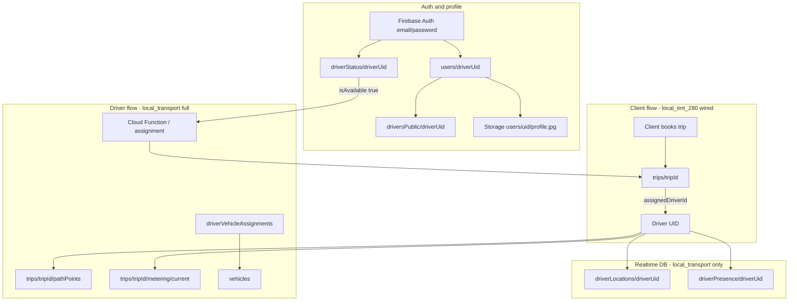

# Driver — Firebase collections map

Project: **local-transport-482015**  
Apps: **local_ent_280** (production UI + full backend in-repo) · **local_transport** (original reference app)

Screenshots in this folder (`Screenshot_3.png`, `image.png`) show the live Firestore console: a **`trips`** document created by the client app with `status: REQUESTED` and `assignedDriverId: null` (waiting for a driver).

---

## Quick summary (বাংলায়)

| কাজ | Collection | Document ID |
|-----|------------|-------------|
| Driver account | `users` | `{driverUid}` |
| Online / busy status | `driverStatus` | `{driverUid}` |
| Public name/photo for client | `driversPublic` | `{driverUid}` |
| Which car driver uses | `driverVehicleAssignments` | `{driverUid}` |
| Car details | `vehicles` | `{vehicleId}` |
| Trip request / active trip | `trips` | `{tripId}` |
| Live GPS route | `trips/{tripId}/pathPoints` | `{pointId}` |
| Live fare meter | `trips/{tripId}/metering/current` | `current` |
| Profile photo file | **Storage** `users/{uid}/profile.jpg` | — |

**local_ent_280 today:** register + login + profile write **`users`** and **`driverStatus`**. Client creates **`trips`**. Driver screens are **wired to Firebase** — availability toggle, trip offers, accept/decline, active trip lifecycle, and Google Maps on all driver map screens.

---

## Architecture (data flow)



---

## Collections used by driver role

### 1. `users/{driverUid}` — account (required)

| Field | Type | Example |
|-------|------|---------|
| `role` | string | `"driver"` |
| `name` | string | `"Ricardo Santos"` |
| `email` | string | `"driver@test.com"` |
| `phone` | string | `"+351910000000"` |
| `photoUrl` | string? | Storage download URL |
| `isActive` | bool | `true` |
| `createdAt` / `updatedAt` | timestamp | server time |

**Who writes:** register screen (`AuthRepository.signUp`), admin, profile edit (name/photo).  
**local_ent_280:** `lib/features/auth/data/auth_repository.dart`, `lib/features/profile/data/profile_repository.dart`

---

### 2. `driverStatus/{driverUid}` — availability (required for driver)

| Field | Type | Meaning |
|-------|------|---------|
| `isActive` | bool | Account enabled |
| `isAvailable` | bool | Accepting new trips |
| `availabilityEnabled` | bool | Driver turned availability on |
| `currentTripId` | string? | Active trip ID |
| `vehicleId` | string? | Linked vehicle |
| `updatedAt` | timestamp | Last change |

**Who writes:** driver app (toggle online), admin, register (initial doc).  
**local_ent_280:** created on **driver register** only — driver home does **not** read/update yet.  
**local_transport:** `lib/features/driver/data/repositories/driver_status_store_impl.dart`

---

### 3. `driversPublic/{driverUid}` — public card (optional)

Shown to **client** on “driver found” screen (name, photo, rating, vehicle summary).

| Field | Type |
|-------|------|
| `displayName` | string |
| `photoUrl` | string? |
| `rating` | double? |
| `vehicleSummary` | map `{ plate, model }` |
| `updatedAt` | timestamp |

**local_ent_280:** rules allow driver to write own doc — **not implemented in app yet**.

---

### 4. `driverVehicleAssignments/{driverUid}` — car link

| Field | Type |
|-------|------|
| `vehicleId` | string |
| `updatedAt` | timestamp |

Driver reads **`vehicles/{vehicleId}`** for model, plate, transport type.

**local_ent_280:** not wired.

---

### 5. `trips/{tripId}` — main trip document

This matches your screenshot (`1FzcpayAjDRsODjgvmTm`):

```
trips/{tripId}
├── clientId              "NTbCdej2jofTc3t2yPk7fqfkn9Cu1"
├── assignedDriverId      null  → set when driver assigned
├── status                "REQUESTED" | "DRIVER_ACCEPTED" | ...
├── isActive              true / false
├── pickup                { address, latitude, longitude }
├── destination           { address, latitude, longitude }
├── transportType         { id, name }
├── meteringSnapshot      { totalDistanceKm, totalMinutes, estimatedCostMinor, ... }
├── clientSupport         { displayName, phone }
├── createdAt / requestedAt / updatedAt
└── (later) driverSummary, vehicleSummary, pricingSnapshot, ...
```

**Client (local_ent_280 wired):**  
`TripRepository.createTrip()` → `lib/features/trips/data/trip_repository.dart`

**Driver should:**  
- **Listen** `trips` where `assignedDriverId == myUid` OR `status == REQUESTED` (via Cloud Function in reference app)  
- **Update** status, metering (rules: `isDriverTripMeteringUpdateAllowed`)

**local_ent_280:** client create + watch works; **driver accept/en-route/in-progress screens are mock timers**.

---

### 6. `trips/{tripId}/pathPoints/{pointId}` — GPS trail

Driver writes location points during trip.  
**Rules:** assigned driver can write.  
**local_transport:** yes · **local_ent_280:** not wired.

---

### 7. `trips/{tripId}/metering/current` — live meter

Driver updates distance/time/cost while trip runs.  
**local_ent_280:** rules exist · app not wired.

---

### 8. Other collections (read / admin / future)

| Collection | Driver use |
|------------|------------|
| `transport_types` | Read tariff types for pricing |
| `tariffs` | Read pricing rules |
| `vehicles` | Read assigned vehicle |
| `reservations` | Read if `assignedDriverId == driverUid` |
| `chatThreads` | Trip chat (if enabled) |
| `balances` | **Client only** — not driver |
| `events`, `tripPackages`, `jobs` | Admin / ops — not driver daily flow |

---

### 9. Firebase Storage (not Firestore)

| Path | Use |
|------|-----|
| `users/{uid}/profile.jpg` | Profile photo (all roles) |

Rules: `roles/storage.rules`

---

### 10. Realtime Database (local_transport only)

| Node | Use |
|------|-----|
| `driverLocations/{driverId}` | Live map position |
| `driverPresence/{driverId}` | Online heartbeat |

**local_ent_280:** not used yet.

---

## Trip status lifecycle (driver view)

| Status | Meaning | Driver action |
|--------|---------|---------------|
| `REQUESTED` | Client created trip | System assigns driver |
| `DRIVER_ASSIGNED_WAITING_ACCEPTANCE` | Offer sent | Accept / decline |
| `DRIVER_ACCEPTED` | Driver accepted | Navigate to pickup |
| `DRIVER_EN_ROUTE` | Going to client | GPS + map |
| `DRIVER_ARRIVED` | At pickup | Wait for client |
| `IN_PROGRESS` | Trip running | Meter + pathPoints |
| `COMPLETED` | Finished | Show receipt |
| `CANCELLED_BY_CLIENT` / `CANCELLED_BY_DRIVER` | Cancelled | — |

Reference app changes most statuses via **Cloud Functions** (`requestTrip`, `transitionTripState`).  
**local_ent_280** uses **direct Firestore create** for client only.

---

## local_transport vs local_ent_280

| Feature | local_transport | local_ent_280 |
|---------|-----------------|---------------|
| Driver register → `users` + `driverStatus` | Admin / seed | **Register screen** |
| Driver login + session | Yes | **Yes** |
| Profile name/photo | Yes | **Yes** (needs rules published) |
| `driversPublic` | Yes | Rules only |
| `driverVehicleAssignments` | Yes | Not wired |
| Listen incoming trips | Cloud Functions + queries | **Firestore query** (`REQUESTED` → claim) |
| Accept / decline trip | Callable + Firestore | **Direct Firestore** (`DriverRepository`) |
| `pathPoints` / `metering` | Yes | Rules only |
| Realtime `driverLocations` | Yes | No |
| Client `trips` create | Callable `requestTrip` | **Direct Firestore** |

---

## local_ent_280 — code files by role

### Wired to Firebase

| Screen / feature | File | Collection |
|------------------|------|------------|
| Register (driver) | `lib/features/auth/data/auth_repository.dart` | `users`, `driverStatus` |
| Login | same | `users` (read) |
| Profile | `lib/features/profile/data/profile_repository.dart` | `users`, Storage |
| Client book trip | `lib/features/trips/data/trip_repository.dart` | `trips` |
| Client watch trip | `driver_search_screen.dart` + `TripRepository.watchTrip` | `trips` |
| Trip history (client) | `trip_history_screen.dart` | `trips` |
| Driver availability | `lib/features/driver/data/driver_repository.dart` | `driverStatus` |
| Driver listen / claim trips | `driver_home_screen.dart` | `trips` |
| Driver accept / decline | `driver_trip_request_screen.dart` | `trips` |
| Driver active trip lifecycle | `driver_active_trip_screen.dart` | `trips` |
| Driver maps (Google Maps) | `lib/presentation/widgets/driver_map_layer.dart` | Maps API key in `google_maps_config.dart` |

### Driver UI — mock fallback only

| Screen | Still uses mock for |
|--------|---------------------|
| Trip request | Passenger rating (not in `trips` yet) |
| Active trip | VIP badge, live distance-to-destination banner |

**Driver home dashboard** (earnings, trips, distance, recent trips, vehicle) is now **100% Firebase** — shows `€0.00`, `0`, `0 km`, and empty states when no data.

---

## Implemented driver flow (local_ent_280)

1. Driver toggles **Available** → writes `driverStatus/{uid}.isAvailable`
2. Home listens for `trips` with `status: REQUESTED` → **claims** trip (`assignedDriverId`, `DRIVER_ASSIGNED_WAITING_ACCEPTANCE`)
3. **Trip request** screen → accept (`DRIVER_ACCEPTED` + `driverSummary`) or decline (back to `REQUESTED`)
4. **Accepted** → **Start navigation** → `DRIVER_EN_ROUTE` → active trip screen
5. Active trip: `DRIVER_ARRIVED` → `IN_TRIP` → `COMPLETED` (+ `driverStatus` cleared)

**Publish updated `roles/firestore.rules`** before testing (driver trip read/claim/accept rules added).

## What to wire next (optional)

1. **Sync `driversPublic/{uid}`** from `users` on profile update
2. **`driverVehicleAssignments`** + vehicle card on home
3. **Cloud Functions** like `local_transport` for safer multi-driver assignment
4. **Realtime `driverLocations`** (RTDB) for live client map

---

## Rules files

| File | Purpose |
|------|---------|
| `roles/firestore.rules` | All collection permissions (publish to Firestore Console) |
| `roles/storage.rules` | Profile photos (publish to Storage Console) |
| `roles/firebase roles.md` | Copy-paste copy of Firestore rules |

After changing rules, publish in Firebase Console and hot restart the app.

---

## Screenshot reference

Your **`trips`** document shows a successful **client** booking:

- `clientId` → links to `users/{clientId}`
- `assignedDriverId: null` → no driver assigned yet
- `pickup` / `destination` → map + confirm screen data
- `meteringSnapshot` → price estimate from Google Directions
- `isActive: false` in screenshot may mean cancelled or completed — check `status` field in console

When a driver is assigned, `assignedDriverId` becomes the driver’s UID and driver apps should read this document in real time.
